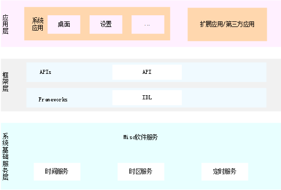

# 时间组件<a name="ZH-CN_TOPIC_0000001115554184"></a>

-   [简介](#section11660541593)
-   [目录](#section161941989596)
-   [说明](#section38521239153117)
    -   [js接口说明](#section11908203714422)
    -   [js接口使用说明](#section9938411124317)

-   [相关仓](#section1371113476307)

## 简介<a name="section11660541593"></a>

时间组件提供管理系统时间的能力。

**图 1**  子系统架构图<a name="fig143011012341"></a>  


## 目录<a name="section161941989596"></a>

```
/base/miscservices/time
├── etc                      # 组件包含的进程的配置文件
├── figures                  # 构架图
├── interfaces               # 组件对外提供的接口代码
│   └── innerkits            # 服务间接口
│   └── kits                 # 对应用提供的接口
├── profile                  # 组件包含的系统服务的配置文件
└── services                 # 时间服务实现
```

## 说明<a name="section38521239153117"></a>

### js接口说明<a name="section11908203714422"></a>

**表 1**  js组件systemTime开放的主要方法

<a name="table033515471012"></a>
<table><thead align="left"><tr id="row143351854201012"><th class="cellrowborder" valign="top" width="50%" id="mcps1.2.3.1.1"><p id="p103351154121010"><a name="p103351154121010"></a><a name="p103351154121010"></a>接口名</p>
</th>
<th class="cellrowborder" valign="top" width="50%" id="mcps1.2.3.1.2"><p id="p1033585416105"><a name="p1033585416105"></a><a name="p1033585416105"></a>描述</p>
</th>
</tr>
</thead>
<tbody><tr id="row204321219393"><td class="cellrowborder" valign="top" width="50%" headers="mcps1.2.3.1.1 "><p id="p1893413268144"><a name="p1893413268144"></a><a name="p1893413268144"></a>function setTime(time : number) : Promise&lt;boolean&gt;</p>
</td>
<td class="cellrowborder" valign="top" width="50%" headers="mcps1.2.3.1.2 "><p id="p18761104812149"><a name="p18761104812149"></a><a name="p18761104812149"></a>设置系统时间，Promise方式</p>
</td>
</tr>
<tr id="row13335054111018"><td class="cellrowborder" valign="top" width="50%" headers="mcps1.2.3.1.1 "><p id="p12832214151418"><a name="p12832214151418"></a><a name="p12832214151418"></a>function setTime(time : number, callback : AsyncCallback&lt;boolean&gt;) : void</p>
</td>
<td class="cellrowborder" valign="top" width="50%" headers="mcps1.2.3.1.2 "><p id="p3335145451011"><a name="p3335145451011"></a><a name="p3335145451011"></a>设置系统时间，callback方式</p>
</td>
</tr>
</tbody>
</table>

### js接口使用说明<a name="section9938411124317"></a>

systemTime模块使用示例：

```
// 导入模块
import systemTime from '@ohos.systemTime';

// Promise方式的异步方法设置时间
var time = 1611081385000;
systemTime.setTime(time)
    .then((value) => {
        console.log(`success to systemTime.setTime: ${value}`);
    }).catch((err) => {
        console.error(`failed to systemTime.setTime because ${err.message}`);
    });

// callback方式的异步方法设置时间
var time = 1611081385000;
systemTime.setTime(time, (err, value) => {
    if (err) {
        console.error(`failed to systemTime.setTime because ${err.message}`);
        return;
    }
    console.log(`success to systemTime.setTime: ${value}`);
});
```

## 相关仓<a name="section1371113476307"></a>

**Misc软件服务子系统**

miscservices\_time

